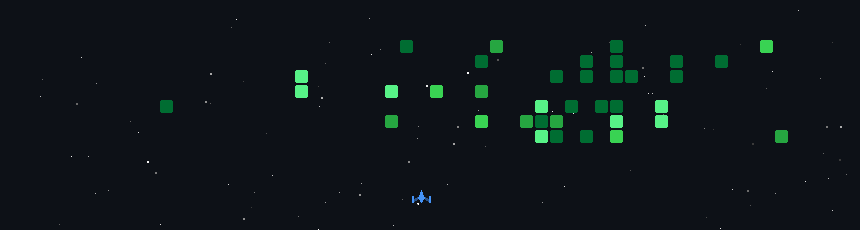
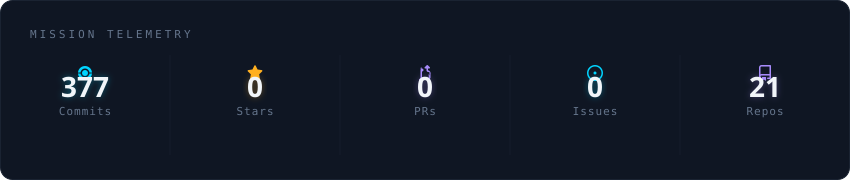

<picture>
  <source media="(prefers-color-scheme: dark)" srcset="assets/generated/galaxy-header.svg">
  <source media="(prefers-color-scheme: light)" srcset="assets/generated/galaxy-header.svg">
  
</picture>

  <h3>🚀 GitHub Contributions Space Shooter</h3>
  

<picture>
  <source media="(prefers-color-scheme: dark)" srcset="assets/generated/stats-card.svg">
  <source media="(prefers-color-scheme: light)" srcset="assets/generated/stats-card.svg">
  
</picture>

<picture>
  <source media="(prefers-color-scheme: dark)" srcset="assets/generated/tech-stack.svg">
  <source media="(prefers-color-scheme: light)" srcset="assets/generated/tech-stack.svg">
  
</picture>

<picture>
  <source media="(prefers-color-scheme: dark)" srcset="assets/generated/projects-constellation.svg">
  <source media="(prefers-color-scheme: light)" srcset="assets/generated/projects-constellation.svg">
  
</picture>

---

### 📫 Let's Connect

  
  

